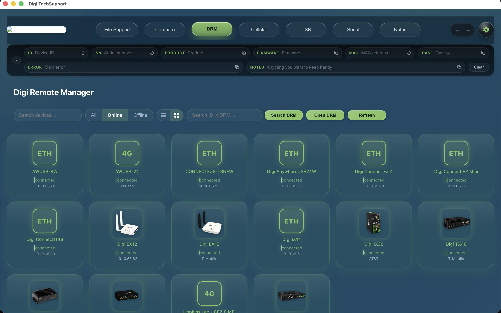
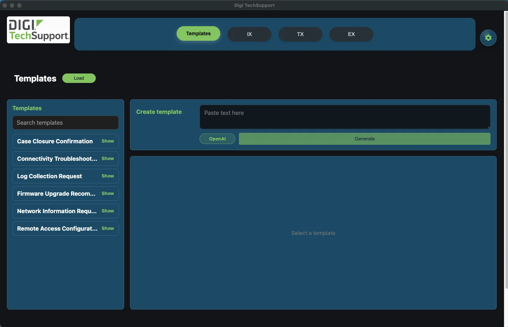
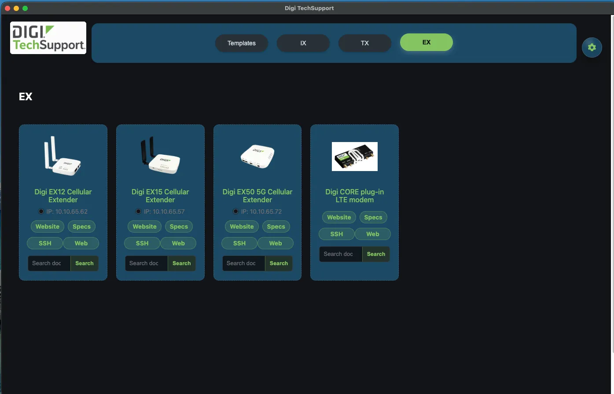
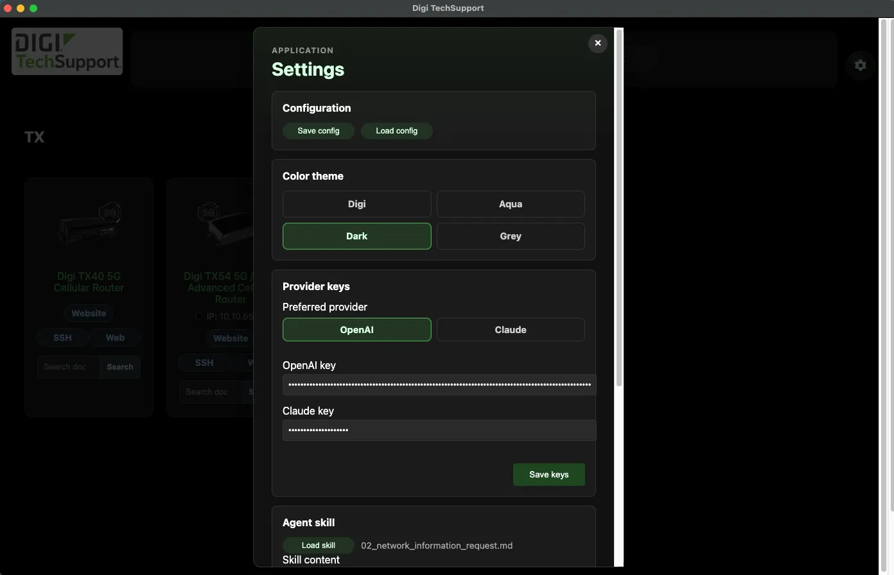

Digi TechSupport
================

## Release 4.0 Coming

New Diff tools and more Digi products are coming soon.

Desktop app built with Electron for technical support workflows around Digi devices. It includes TCP/ping checks, product organization by lines, SSH terminal sessions, Digi Remote Manager integration, support archive file viewer, configuration import/export, and a templates workspace with AI-assisted generation.

Development
-----------
1. `npm install`
2. `npm start`

Optional HTTP Server
--------------------
- `npm run serve-http` starts the static server at `http://localhost:3000`.
- By default it serves `dist/` when it exists, otherwise it serves the project root.
- Change the port with `DIGI_TECHSUPPORT_HTTP_PORT=XXXX npm run serve-http`.
- Change the served folder with `DIGI_TECHSUPPORT_STATIC_ROOT=./dist npm run serve-http`.
- The HTTP server also exposes `POST /api/generate-template` for template generation.

General Build
-------------
- `npm run build`
- Artifacts: `dist/mac/`, `dist/win/`, `dist/linux/`

Platform Builds
---------------
- macOS universal: `npm run build -- --mac`
- Windows x64: `npm run build -- --win --x64`
- Linux: `npm run build -- --linux`

Specific macOS Architectures
----------------------------
- Apple Silicon (M1/M2/M3): `npm run build -- --mac --arm64`
- Intel: `npm run build -- --mac --x64`

Main Features
-------------
- Product lines such as `IX`, `TX`, and `EX`, with support for adding new lines and products.
- Product cards with name, IP address, DNS domain, TCP ports, scan interval, and custom image.
- TCP port checks and ping polling on a configurable interval per card.
- SSH terminal sessions directly from a product card using xterm.js.
- Digi Remote Manager (DRM) integration to fetch and display cloud-managed devices.
- Support file viewer: import Digi support archives or readable text files, browse the file tree, and run AI analysis on selected entries.
- Templates workspace for creating, loading, editing, searching, copying, and deleting support templates.
- AI-assisted template generation using either OpenAI or Claude.
- Configuration import/export through the Settings modal.

Settings
--------
The Settings modal now includes the following options:

### Configuration
- `Save config` exports the current app state to JSON.
- `Load config` restores a saved configuration.
- Stored configuration includes products, lines, and saved support templates.

### Color Theme
- Available themes: `Digi`, `Aqua`, `Dark`, and `Grey`.
- The selected stylesheet is applied immediately and persisted locally.

### Provider Keys
- Preferred provider selector: `OpenAI` or `Claude`.
- Dedicated API key field for each provider.
- Keys are stored locally in the app and reused when generating templates.

### Agent Skill
- Load a skill file (`.md`, `.markdown`, `.txt`, or `.json`) or paste the content manually.
- The saved skill is used as the instruction set for AI template generation.

### Templates
- `Delete all templates` permanently removes saved templates from the local app state.

SSH Terminal
------------
Each product card includes an SSH button that opens an inline terminal session powered by xterm.js. Connection fields (host, username, password) are pre-filled from the card's configured IP and stored credentials. SSH access is restricted to private and local IP ranges.

Digi Remote Manager
--------------------
The DRM panel fetches the device inventory from the Digi Remote Manager cloud API. Credentials (server URL and API key) are stored securely in the app's userData directory. Devices are listed with their name and online/offline status. The HTTP server also exposes `GET /api/digi/devices` for headless access.

Support Archive Viewer
-----------------------
The File Support view imports Digi support archives (`.bin`, `.gz`, `.tgz`, or `.tar`) and readable text files such as `.txt`, `.md`, `.log`, and ASCII files without a special extension. After import:
- A file tree shows all entries inside the archive.
- Selecting a file displays its raw content.
- Grep mode (`Ctrl+G`) filters content by keyword; cut mode (`Ctrl+C`) trims surrounding blank lines.
- The AI analysis button sends the selected file content to the configured provider for analysis.
- Files can be saved to a local support library and reopened later.

AI Template Generation
----------------------
Template generation requires:

1. A saved `Agent skill`
2. A preferred provider selected in Settings
3. A valid API key for that provider
4. Source text pasted into the template generator input

When generation runs:
- `OpenAI` calls the Responses API.
- `Claude` calls the Anthropic Messages API.
- The generated result is returned as Markdown and added as a draft template before being saved to the main library.

Default models:
- OpenAI: `gpt-4.1-mini`
- Claude: `claude-sonnet-4-5`

Templates Workspace
-------------------
- **New** — creates a blank draft template ready to edit and save.
- **Load** — imports one or more `.md` / `.markdown` files as templates.
- Templates can be edited inline, searched, copied to clipboard, and deleted.
- Unsaved drafts are kept in `sessionStorage` until explicitly saved to the main library.

Keyboard Shortcuts — File Support
----------------------------------

| Key | Action |
|-----|--------|
| `F` | Toggle viewer fullscreen |
| `Esc` | Exit fullscreen |
| `Ctrl+G` | Toggle grep mode on/off |
| `Ctrl+C` | Toggle cut mode (only when grep is active) |

Keyboard Shortcuts — SSH Terminal
----------------------------------
Standard terminal input is passed through. The terminal resizes automatically when the window changes size.

Local Persistence
-----------------
- Theme selection, provider preference, API keys, loaded agent skill, and templates are persisted locally in the renderer.
- Temporary generated drafts are kept separately until saved.
